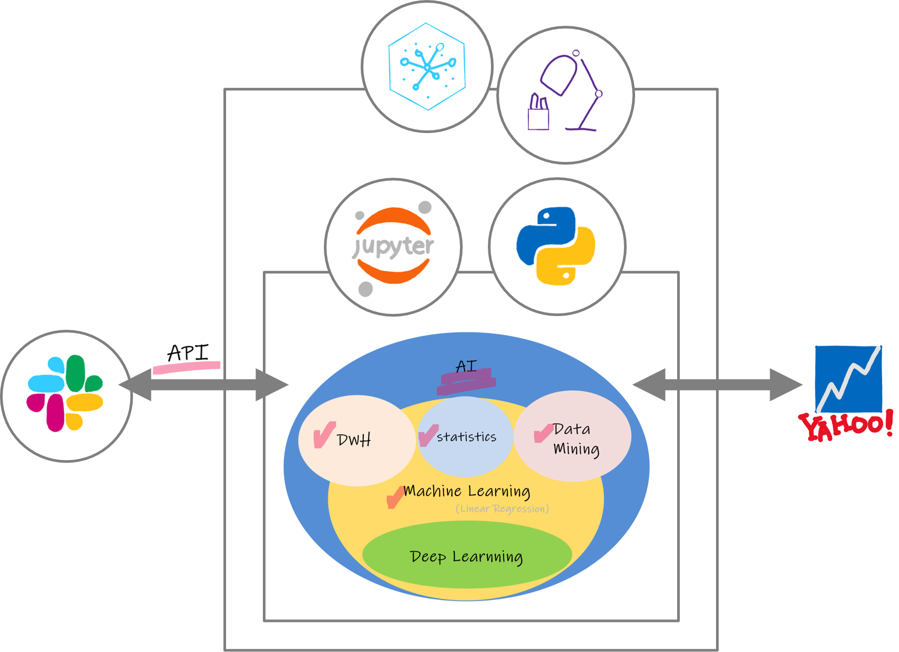

# Stock Prediction Slack Notification using Jupyter Notebooks on Watson Studio (IBM Cloud Pak for Data)



## Prereqirements

* [IBM Cloud Account](https://cloud.ibm.com/)

## Setup
Download [predict_stock.ipynd](predict_stock.ipynd) with `wget` command into your directory:

```bash
$cd <directory which you want to install the file>
$ wget https://raw.githubusercontent.com/y-leaf/jupyter-Notebook-stock/main/predict_stock.ipynb
```


# Steps 

Follow these steps to set up. The steps are described in detail below.

1. [Create Watson Studio Service and Project](#1-create-watson-studio-service-and-project)
2. [Add Notebook to the project](#2-add-notebook-to-the-project)
3. [Check each line on Notebook](#3-check-each-line-on-notebook)
4. [Create a job](#4-create-a-job)
5. [Slack API with Incomming Webhook](#5-slack-api-with-incomming-webhook)

--------------------

### 1. Create Watson Studio Service and Project

1. Login IBM Cloud and create Watson Studio Service form Catalog

* [IBM Cloud Account](https://cloud.ibm.com/)

2. Add a project to your Watson Studio


--------------------

### 2. Add Notebook to the project

1. Choose Notebook from "Add to project+

2. Upload [predict_stock.ipynd](predict_stock.ipynd) to the Notebook


--------------------

### 3. Check each line on Notebook

1. To 1st cell: Add "The project token" which is an authorization token that is used to access project resources like data sources, connections, and used by platform APIs

```bash
 project = Project(project_id='<project_id>', project_access_token='<project_access_token>')
```
2. To 5th cell: DWH

(Optional) You can change stock data to analyze. (IBM, Amazon, and Microsoft in the original scenario)

```bash
 df_ibm = pandas_datareader.data.DataReader('IBM',  'yahoo', '2018-01-01')
 df_amzn = pandas_datareader.data.DataReader('AMZN',  'yahoo', '2018-01-01')
 df_msft = pandas_datareader.data.DataReader('MSFT',  'yahoo', '2018-01-01')
```

3. The 12th cell: Statistics (Simple Moving Average)

Compare IBM SMA and Close to get some insight.

4. The 13rd cell: Data Mining

Calculate change ratio of each company and compare them.

5. The 17th cell: Machine Learning

Try to predict IBM stock in the future using Liner Regression


--------------------

### 4. Slack API with Incomming Webhook

1. Add Incoming Webhook and copy the URL

 to your workspace's channel


2. Add Webhook URL to the 25th cell

```bash
post_url="<Slack Webhook URL>"
```


3. You can arrange slack notification message

* add <username>
* change slack emoji using `:<emoji_name>:`

```bash
if c > 0:
    UpDown=":arrow_double_up:"
else:
    UpDown=":arrow_double_down:"

notification="Hi, <username>."+"\n\n"+":ibm: stock forecast for tomorrow:"+"\n"+"[ "+str(round(df_ibm['Predict'].tail(30)[0], 2))+" ]"+"\n\n"+"Oops! Change"+UpDown+"  "+str(round(d, 2))+" / "+str(round(c, 2))+"%"+"\n\n"+"Have a nice day :woman-cartwheeling:"

def post_slack(content):
    requests.post(
        post_url,
        data=json.dumps(
            {"text": content,
             "username": "StockForecast",
             "icon_emoji": ":wat:"}))
```


--------------------

### 5. Create a job

1. Save version of the Notebook

2. Create a job to notify stock prediction everyday (except Sat and Sun).
